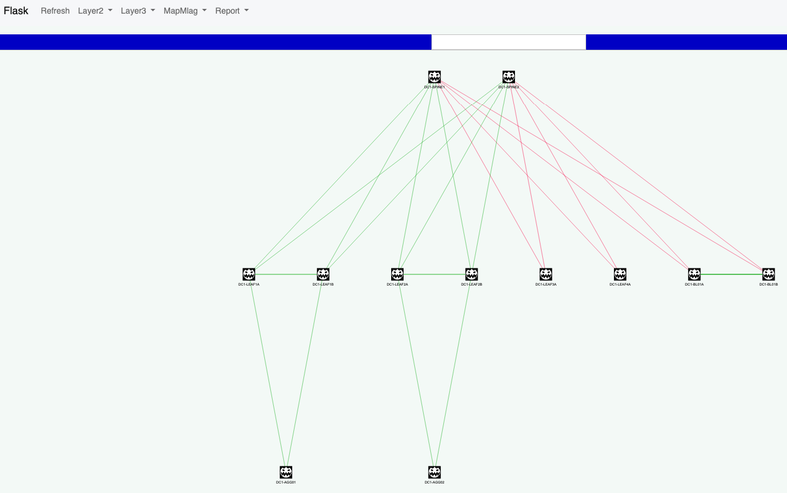

[](https://github.com/arista-netdevops-community/Arista_Cabling_Check/blob/master/LICENSE)

# arista_Check

Software to check EOS topology and validate physical deployment in large environment.



## Supported features

- Interface status
- LLDP topology
- BGP Status
- BGP status for EVPN
- MLAG Status check
- PDF export.

## Requirements

- Python 3
- Flask
- wkhtmltopdf
- DNS resolution for EOS devices.
- eAPI running on port `80`

## Installation

### Step 1 : Install Python requirements

```shell
$ pip install -r requirements.txt
```

### Step2 : Install wkhtmltopdf to generate PDF files

On Macos, use brew:

```shell
$ brew install Caskroom/cask/wkhtmltopdf
```

On headless centos, use following setup:

```shell
# Install base tool
$ yum install -y wkhtmltopdf

# Required for headless use
$ yum install xorg-x11-server-Xvfb
$ yum install xorg-x11-fonts-Type1 xorg-x11-fonts-75dpi

# Create Service file
$ vim xvfb.service
[Unit]
Description=Virtual Frame Buffer X Server
After=network.target

[Service]
ExecStart=/usr/bin/Xvfb :42 -screen 0 1024x768x24 -ac +extension GLX +render -noreset

[Install]
WantedBy=multi-user.target

# Deploy service
$ cp xvfb.service /etc/systemd/system/xvfb.service
$ sudo systemctl enable xvfb.service && sudo systemctl start xvfb.service && sudo systemctl status xvfb.service
$ sudo systemctl daemon-reload

# Create binary
$ printf '#!/bin/bash\nxvfb-run -a --server-args="-screen 0, 1024x768x24" /usr/bin/wkhtmltopdf -q $*' > /usr/bin/wkhtmltopdf.sh
$ chmod a+x /usr/bin/wkhtmltopdf.sh
$ ln -s /usr/bin/wkhtmltopdf.sh /usr/local/bin/wkhtmltopdf

# Run a test
$ wkhtmltopdf http://www.google.com output.pdf
```

## Server Configuration

Server uses DNS hostname to reach devices and connect using eAPI on HTTP port (not HTTPS)

### Generate topology file

Edit the file [referenceCablingMap.json](visuapp/static/data/referenceCablingMap.json)
The network representation is based on level (from 1 to nn)

In general:

- __`level1`__ is for the Spine.
- __`level2`__ is for the Leaf.
- __`level3`__ is for the distribution Leaf.

Reference cable example file:
```json
{
  "level1": {                 // Spine level
    "spine1": {               // Spine hostname
      "1": ["leaf1-A","1"],   // Spine1_Eth1 connected to leaf1-A Ethernet1
      "2": ["leaf1-B","1"]
    },
    "spine2": {
      "1": ["leaf1-A","2"],
      "2": ["leaf1-B","2"]
    }
  },
  "level2": {
    "leaf1-A": {
      "3": ["leaf1-B","3"],
      "5": ["leaf3-A","1"]
    },
    "leaf1-B":{
      "5": ["leaf3-A","2"],
      "6":["leaf-level2","2"]
    },
    "leaf2-A": {
      "3": ["leaf2-B","3"],
      "4":["leaf4-A","1"]
    },
    "leaf2-B":{
      "4":["leaf4-A","2"]
    }
  },
  "level3":{
    "leaf3-A":{
      "18":["leaf5-A","1"]
    }
  }
}
```

### Configure Username and password

Edit file [dwarfFunction.py](./dwarfFunction.py) and change value for username and password:

```python
username = 'dwarf'
password = 'arista'
```

### Change DC hostname (optional)

Edit [`config.py`](./config.py) accordingly:

```python
AUTHOR = "EOS User"
SITE = "DC1 Fabric"
```

### Run service

when executed, server is configured to listen on all interfaces on port 80. It means, you need to get root permission to open socket on that particular port

```shell
[root@centos7-lab arista_Check]# python3 run.py
 * Serving Flask app "visuapp.views" (lazy loading)
 * Environment: production
   WARNING: This is a development server. Do not use it in a production deployment.
   Use a production WSGI server instead.
 * Debug mode: off
 * Running on http://0.0.0.0:80/ (Press CTRL+C to quit)
10.73.1.240 - - [06/Jun/2020 12:05:47] "GET /static/css/bootstrap/bootstrap.min.css HTTP/1.1" 200 -
10.73.1.240 - - [06/Jun/2020 12:05:47] "GET /static/css/pdf.css HTTP/1.1" 200 -
10.73.1.28 - - [06/Jun/2020 12:05:48] "GET /mapCablingPdf HTTP/1.1" 200 -
10.73.1.28 - - [06/Jun/2020 12:06:01] "GET / HTTP/1.1" 200 -
```

## License

Project is published under [Apache License](LICENSE).
